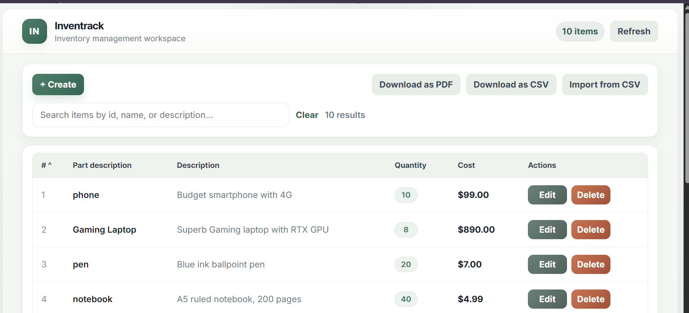
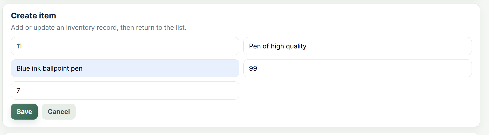
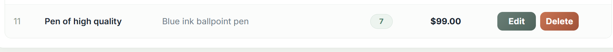

# Inventrack

Inventrack is a full-stack product inventory management system with a FastAPI backend and a React frontend. It allows you to track, add, edit, delete, filter, and export/import products in a clean, user friendly dashboard.

---

## Features

- View all products, filter, and sort
- Add, edit, and delete products
- Import/export inventory as CSV
- Download inventory as PDF (print)
- REST API with CRUD endpoints
- Interactive API docs (Swagger UI)

Main page

Create an item

Item added to inventory 

---

## Backend (FastAPI)

- **Stack:** FastAPI, SQLAlchemy, PostgreSQL, Pydantic
- **Key files:**
   - `main.py`: FastAPI app, endpoints, DB init
   - `database.py`: DB connection (SQLAlchemy)
   - `database_models.py`: SQLAlchemy models
   - `models.py`: Pydantic schemas

### Main Endpoints

- `GET /` — Welcome message
- `GET /products/` — List all products
- `GET /products/{id}` — Get product by ID
- `POST /products/` — Create product
- `PUT /products/{id}` — Update product
- `DELETE /products/{id}` — Delete product

### Product Model

| Field       | Type    | Description                |
|-------------|---------|----------------------------|
| id          | int     | Unique product ID          |
| name        | string  | Product name               |
| description | string  | Product description        |
| price       | float   | Price per unit             |
| quantity    | int     | Quantity in stock          |

---

## Frontend (React)

- **Stack:** React, Axios, CSS
- **Key files:**
   - `frontend/src/App.js`: Main dashboard UI
   - `frontend/public/index.html`: HTML template
   - `frontend/package.json`: Scripts & dependencies

### Main Features

- Dashboard: List, filter, sort, and search products
- Add/Edit/Delete products with form
- Import/export CSV, print as PDF

---

## Getting Started

### 1. Backend Setup

```bash
# Create and activate virtual environment
python -m venv myenv
myenv\Scripts\activate.ps1  # Windows PowerShell

# Install dependencies
pip install fastapi uvicorn sqlalchemy psycopg2 pydantic

# Start PostgreSQL and ensure DB connection string in database.py is correct

# Run the FastAPI server
uvicorn main:app --reload
```

API Docs: [http://localhost:8000/docs](http://localhost:8000/docs)

### 2. Frontend Setup

```bash
cd frontend
npm install
npm start
```

App: [http://localhost:3000](http://localhost:3000)

---

## Example API Usage

```bash
# Get all products
curl http://localhost:8000/products/

# Get product by ID
curl http://localhost:8000/products/1

# Create a new product
curl -X POST "http://localhost:8000/products/" \
       -H "Content-Type: application/json" \
       -d '{
          "id": 5,
          "name": "Monitor",
          "description": "4K monitor",
          "price": 299.99,
          "quantity": 15
       }'
```

---

## Project Structure

```
├── main.py                # FastAPI app & endpoints
├── database.py            # SQLAlchemy DB connection
├── database_models.py     # SQLAlchemy models
├── models.py              # Pydantic schemas
├── frontend/              # React app
│   ├── src/App.js         # Main dashboard UI
│   ├── public/index.html  # HTML template
│   └── ...
└── README.md
```

---

## License

MIT License
